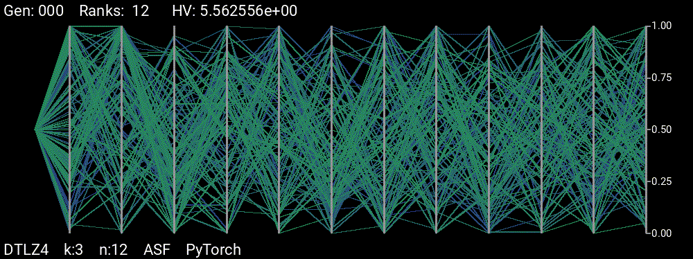

# Pareto Set Plotter

Using generational snapshots, this script creates visual representations of the progression of Pareto optimal sets created by many-objective ant colony optimizers.

Dependencies
-----
*	<b>Python3.5+</b>
*	<b>PIL</b> (Python Imaging Library)
*	<b>ffmpeg</b>: Used to create MP4s, and possibly GIFs, of each visualization. The MP4 versions usually have substantially smaller filesizes, although are in the YUV colour space.
*	[Recommended] <a href="https://www.imagemagick.org/script/download.php"><b>imagemagick</b></a>: ImageMagick's ```convert``` tool is used to create highly-optimized GIFs. The resulting GIFs are usually substantially smaller than those created using ```ffmpeg```.

Usage
-----
Run this script from within a folder containing generational ```.pos``` files, possibly created from my <a href="https://github.com/shumaym/iMOACOR-PyTorch">iMOACO<sub><b>R</b></sub> Implementation</a>; note that you must run ```iMOACOR.py``` with the option ```--snapshots``` to create the generational ```.pos``` snapshots, which will be written to the ```snapshots``` directory.

Run with the following command:
```
python3 <path to plotter.py> [OPTIONS]
```

Options:
*	```-d N | --duration=N```: The duration in seconds of the output media (default: 5.0)
*	```-s N | --stepping=N```: Only process a filename if its generation number is divisible by N
*	```-h```: Attempt to include hypervolume data for each generation, if available
*	```--help```: Display the help page

For generational hypervolumes to be displayed, they must first be created in the same folder by the use of my <a href="https://github.com/shumaym/Hypervolume_Manager">Hypervolume Manager</a>. Make sure to use the same or compatible ```stepping``` values for each script.

By default, the colour of each solution is determined by its relative rank; to support this, each Pareto set solution must include an additional entry containing the solution's rank.

Examples
-----
<div align="center">
<figure>
	
    <figcaption>PyTorch &ndash; ASF: DTLZ4 in 3 dimensions</figcaption>
</figure>
<br>
<figure>
	
    <figcaption>PyTorch &ndash; VADS: DTLZ4 in 3 dimensions</figcaption>
</figure>
<br>
<figure>
	
    <figcaption>PyTorch &ndash; ASF: DTLZ7 in 7 dimensions</figcaption>
</figure>
</div>